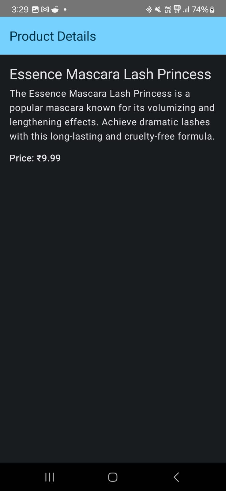
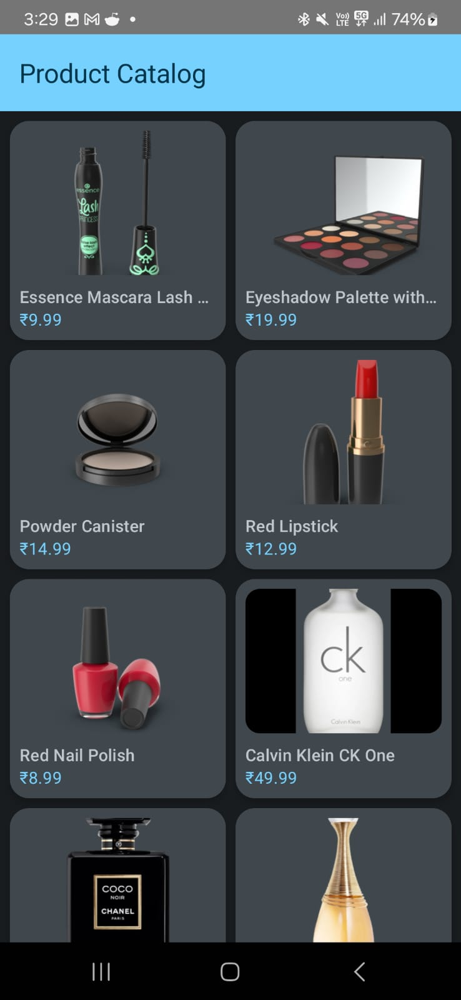

# Product Catalog KMM

Product Catalog KMM is a cross-platform mobile application built using Kotlin Multiplatform Mobile (KMM). It allows users to browse a catalog of products, view product details, and manage their shopping cart seamlessly across iOS and Android platforms.

## Features

- **Product Listing**: Browse a wide range of products with detailed information.

## Screenshots


*Product List Screen showcasing available products.*


*Detailed view of a selected product.*

## Installation

Follow these steps to set up the project on your local machine:

1. **Clone the Repository**:
   ```bash
   git clone https://github.com/AgnivaMaiti/product-catalog-kmm.git
   ```


2. **Open the Project**:
   - For Android development, open the project in Android Studio.
   - For iOS development, open the `iosApp` directory in Xcode.

3. **Build the Project**:
   - In Android Studio, sync the project with Gradle files and run the app on an emulator or device.
   - In Xcode, select the appropriate scheme and run the app on a simulator or device.
